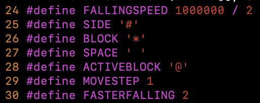

# 俄罗斯方块

纯C实现TUI俄罗斯方块

Visit this to read English version: [README_en.md](README_en.md).

## 目录

- [简介](#简介)

- [功能](#功能)

- [依赖](#依赖)

- [许可证](#许可证)

- [联系方式](#联系方式)

## 简介

🥱 暑假刚刚啃完《C程序设计语言》，挑战自己实现一个俄罗斯方块小游戏。

😎 用了大概1个月左右的时间写的，因为是写的第一个项目，有些不熟练。

🤫 除了注释，其他没有任何AI生成的内容。

😁 注释是由我自己先写，让然后让GPT帮我改一下语法错误和优化一下用词的，非常详细，包看懂的

## 功能

💡 可以自定义游戏窗口大小（采用`./tetris -x -y`的格式)

e.g. `./tetris -20 -21` 或 `./tetris -500 -100`

💡 通过修改Tetris_header.h可以自定义一些参数，如下落速度、移动步伐、显示字符等。

⚠️ 程序在运行时会运行stty -icanon与stty -echo等命令，在正常退出（非ctrl-c）退出时会复原，尽量不要强制退出。可以通过运行stty icanon与stty echo手动复原。

⌨️ 键位：

    `a`：向左移动 ⬅️

    `d`：向右移动 ➡️

    `w`：变换方块（向右旋转90度）

    `q`：退出游戏

🧬 编译

- 修改代码后直接make编译就好 `make`

- 不编译，检查代码使用 `make check`

- 清理其他文件使用 `make clean`

## 依赖

💡 程序针对macOS开发。

⚠️ 未适配Windows。

- 用到了`stty`命令（Windows可能需要调用系统API，如 `SetConsoleMode` 和 `GetConsoleMode`等）

- 用到了`clear`命令（Windows使用`cls`）

- 用到了<unistd.h>（Windows使用<windows.h>，使用Sleep()函数替代usleep()函数）

- 用到了<sys/time.h>（Windows使用<time.h>，可能需要重写`rand_num_giver.c`）

- 用到了<pthread.h>（Windows不适用）

💡 理论上不需要大幅度修改就可以在Linux上运行，但没有经过测试。

## 许可证

😓 虽然这么小的项目没必要使用开源协议，但是我就是想搞一个。

😀 毕竟人家GPT也建议我这么搞（

此项目使用 [MIT License](LICENSE) 进行许可。详细信息请参见 `LICENSE` 文件。

## 联系方式

作者邮箱：yiguo.xfy@icloud.com

bilibili账号名：Ts_小石灰
