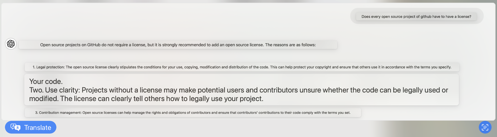

# Tetris

Pure C Implementation of a TUI Tetris Game

点这里以阅读中文版本README: [README_en.md](README_en.md).

## Contents

- [Introduction](#Introduction)

- [Features](#Features)

- [Dependencies](#Dependencies)

- [License](#License)

- [Contact info](#Contact)

## Introduction

🥱 Just finished tackling *The C Programming Language* over the summer and challenged myself to create a Tetris game.

😎 It took about a month to develop since it was my first project and I wasn’t very experienced.

🤫 Besides the comments, there’s no AI-generated content.

😁 The comments were initially written by me, and then I had GPT help me correct grammatical errors and optimize the wording. They are very detailed and easy to understand.

## Features

💡 You can customize the game window size by using command-line arguments when running the game. Use the following format: `tetris -x -y`

e.g. `./tetris -20 -21` or `./tetris -500 -100`

💡You can customize parameters such as falling speed, movement steps, and display characters by modifying Tetris_header.h.

⚠️ The program runs commands like stty -icanon and stty -echo during execution. These settings will be restored upon normal exit (not through Ctrl-C). Please avoid forcefully terminating the program. You can manually restore the settings by running stty icanon and stty echo.

⌨️ Key Bindings：

    `a`：Move left ⬅️

    `d`：Move right ➡️

    `w`：Rotate the block (90 degrees clockwise)

    `q`：Quit the game

🧬 Compilation

- After modifying the code, simply compile with ‘make’.

- To check the code without compiling, use `make check`

- To clean up other files, use `make clean`

## Dependencies

💡 The program is developed for macOS.

⚠️ Not adapted for Windows.

- Uses the `stty` command (Windows may require system API calls such as SetConsoleMode and GetConsoleMode, etc.)

- Uses the `clear` command (Windows uses `cls`)

- Uses <unistd.h> (Windows uses <windows.h>, with Sleep() function replacing usleep())

- Uses <sys/time.h> (Windows uses <time.h>, and may require rewriting `rand_num_giver.c`)

- Uses <pthread.h> (not applicable on Windows)）

💡 In theory, the program should run on Linux with minimal modifications, but it has not been tested.

## License

😓 Even though such a small project doesn’t really need an open-source license, I just wanted to use one.

😀 After all, even GPT suggested I do it this way.

This project is licensed under the [MIT License](LICENSE). For more details, please refer to the `LICENSE` file.

## Contact

E-mail: yiguo.xfy@icloud.com

bilibili ID name: Ts_小石灰
